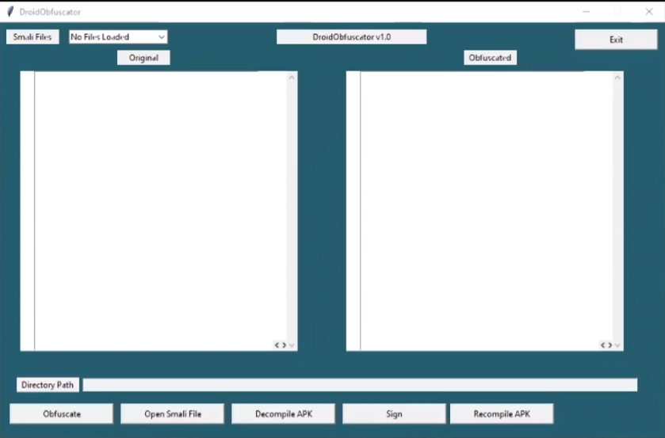
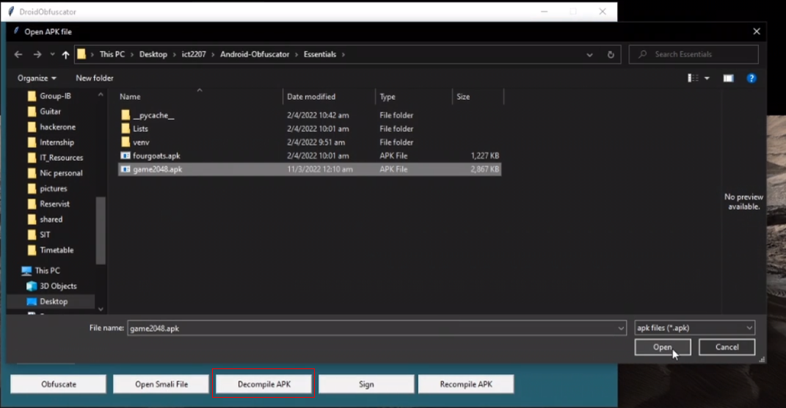
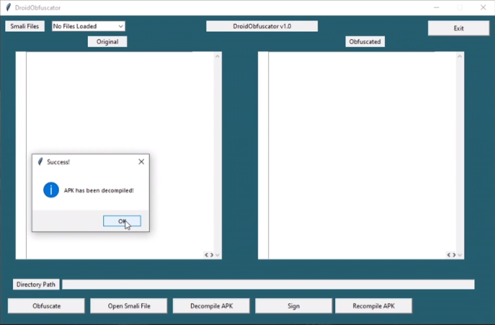
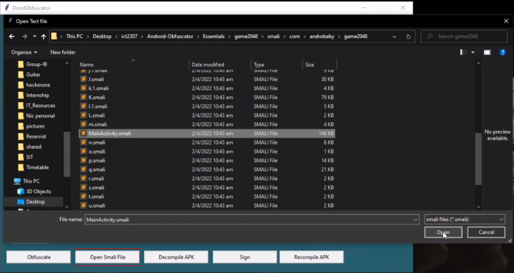
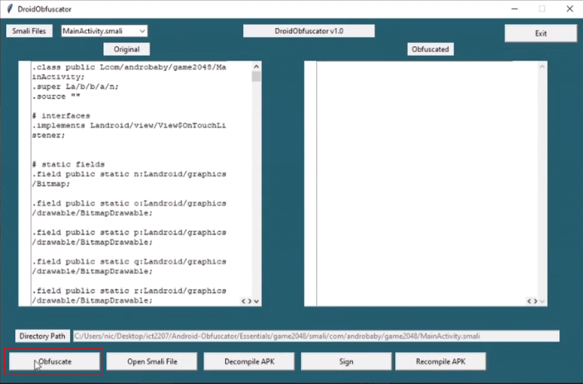
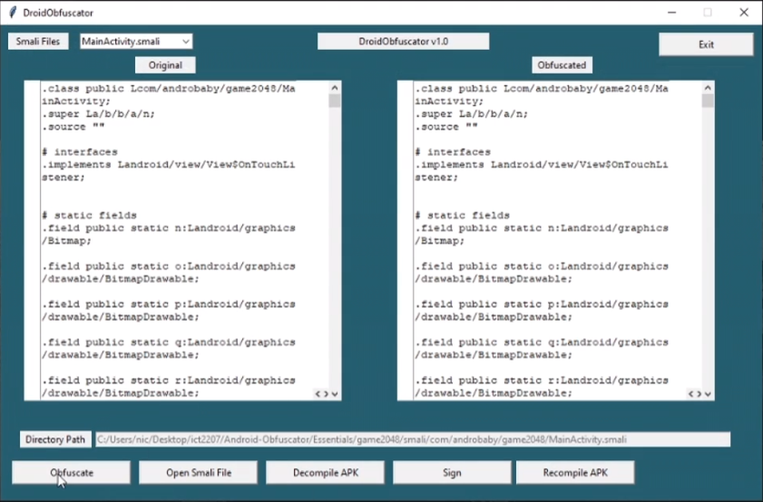
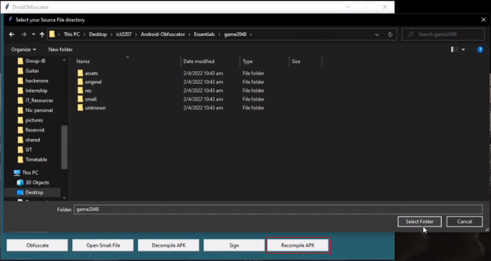
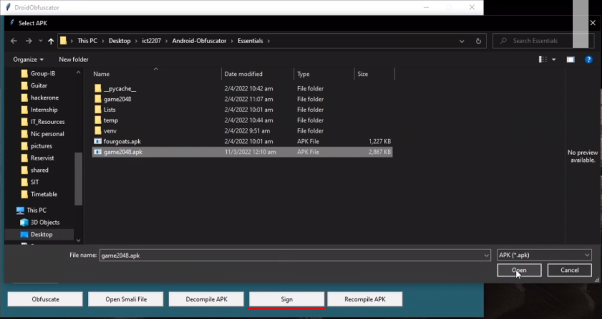

# DroidObfuscator - Android Obfuscation Tool

```bash
# Clone repository
git clone https://github.com/nicchongwb/Android-Obfuscator.git

# Set up python environment - Windows/Ubuntu
cd Essentials
python3 -m venv venv

. venv/bin/activate # Linux
venv\Scripts\activate.bat # Windows

pip install tk

# Start GUI
python3 GUI.py
```

## GUI User Guide


Select the Decompile APK button to decompile APK



Next, select the Open Smali File button to open the smali file that you want to obfuscate


The smali file will be loaded as shown below and select the Obfuscate button


The right panel contains the the obfuscated smali


Next, select the Recompile APK button and select the folder of the decompiled apk


Finally, select the Sign button and select the APK that you want to sign



## Resources:
- [Dalvik Opcodes](http://pallergabor.uw.hu/androidblog/dalvik_opcodes.html)
- [Smali Wiki](https://github.com/JesusFreke/smali/wiki)
- [Regex101](https://regex101.com/)
